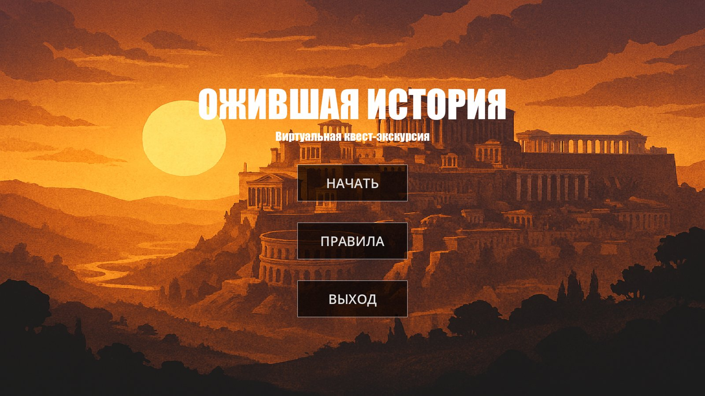
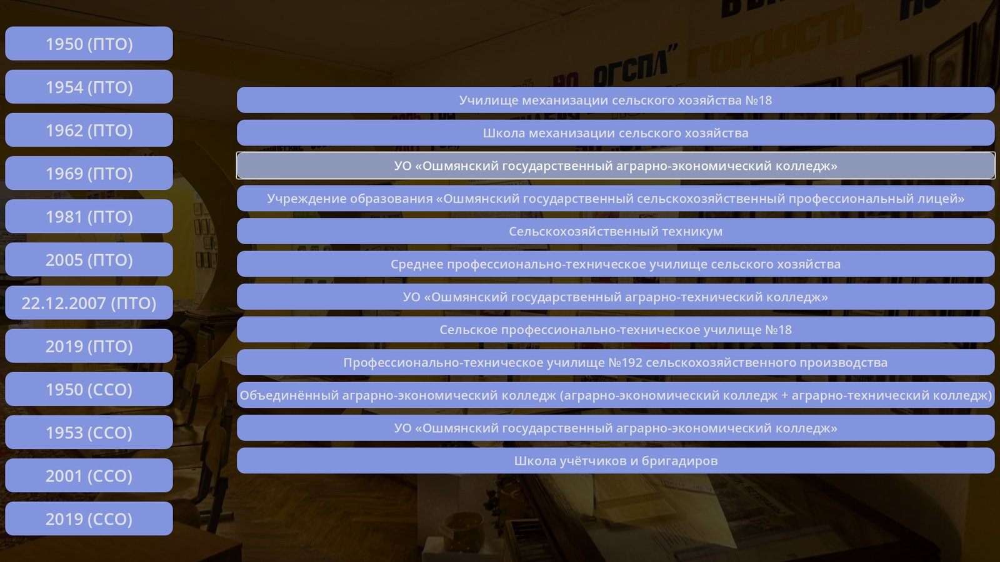

# Ожившая история

Виртуальная квест-экскурсия по музейной комнате «Шляхi нашых гадоў»
Ошмянского государственного аграрно-экономического колледжа. Проводник
ведёт посетителя через пять станций, на каждой своя мини-игра об истории
колледжа, его выпускниках и преподавателях.

Годот 4.5, GDScript, сборка под браузер.

**[Играть на itch.io](https://monsterxlx.itch.io/quiz-game)** ·
[страница музейной комнаты](https://oaek.by/museum/index.html)



## Станции

**I. «История колледжа в цифрах и фактах».** Двенадцать пар: год слева,
название учебного заведения справа. Колледж с 1950 года сменил имя восемь
раз по линии профессионально-технического образования и четыре по линии
среднего специального, и задача в том, чтобы разложить эту цепочку.

**II. «Люди удивительной судьбы».** Медиа-азбука о выпускниках и
преподавателях: фотография, имя и судьба человека.

**III. «Заочная встреча».** Рассказ о ветеране войны и труда Щербачене
Михаиле Никифоровиче.

**IV. «Мир увлечений и интересных дел».** Пазл шесть на четыре с
притягиванием кусков к месту плюс сопоставление предметов с профессиями,
которым учат в колледже: колбы и лаборанты, счёты и бухгалтеры, ноутбук и
программисты.

**V. «Новые горизонты».** Словесные портреты руководителей колледжа: проводник зачитывает описание человека, игрок отгадывает, кто это, и вместе с ответом появляется фотография.



## Как устроено

```
game/                каждая станция отдельной сценой и скриптом
├── game.gd          сценарий экскурсии: реплики, переходы, порядок станций
├── match_game/      I станция
├── media-azbuka/    II станция
├── zaochnaya_vstrecha/  III станция
├── ploshadka/       IV станция, пазл и сопоставление
└── novye_gorizonty/ V станция
elements/            сквозные элементы
├── music_player/    фоновая музыка, автозагрузка
├── Transition/      затемнение между сценами, автозагрузка
├── StationTransition/  заставка с названием станции, автозагрузка
├── guide/           проводник и окно диалога
└── rules/           правила
UI/MainMenu/         главное меню
assets/              фотографии музея, фоны, звук
```

Станции не знают друг о друге: `game.gd` создаёт сцену очередной станции,
ждёт её сигнал об окончании и освобождает её. Проводник, музыка и переходы
подняты в автозагрузку и живут поверх сцен, поэтому переключение станции не
обрывает музыку и не мигает фоном.

Рендер переключён на `gl_compatibility`: сборка под браузер, и это тот
режим, который работает у всех без WebGL 2 и потоков.

## Запуск

Открыть папку проекта в Godot 4.5 и нажать F5.

Готовая сборка под браузер лежит в `BuildsWEB` (в репозиторий не входит,
это 63 МБ артефактов). Собрать свою: **Проект → Экспорт → Web**. Запускать
через локальный сервер, иначе браузер не отдаст wasm:

```bash
python -m http.server 8000
```

и открыть `http://localhost:8000/Quiz_Game.html`.

## Авторы

Учащиеся группы ПО-31: Молчан А.О., Литвин Д.А., Залеский К.В.,
Миклис И.В. Руководитель: Тихонович Тереса Викентьевна.

Материалы музейной комнаты и фотографии принадлежат колледжу.
